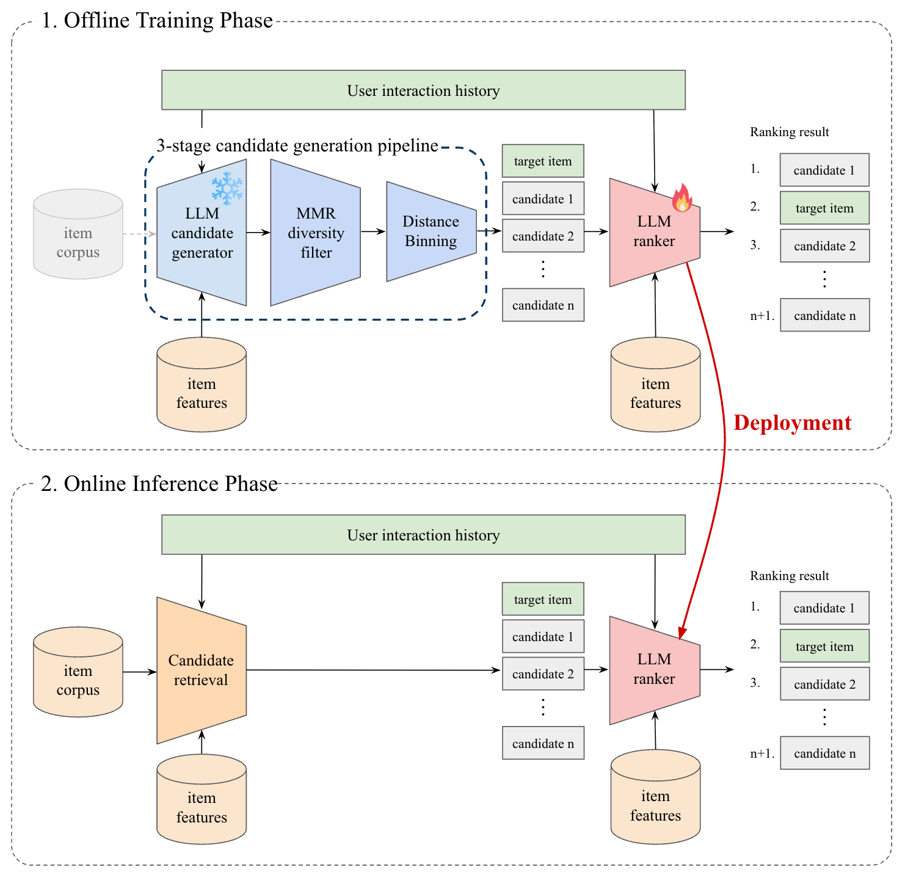

# LCG-Rec: LLM-based Candidate Generation for Few-shot Recommendation Ranking

## Overview

**LCG-Rec** is a novel two-stage recommendation framework that leverages Large Language Models (LLMs) as *candidate generators* rather than traditional retrievers. In few-shot settings, conventional candidate pools often lack diversity and fail to surface hard negatives—both essential for effective ranker training. LCG-Rec addresses this by generating virtual candidates in natural language, tailored to the user's preference and history, without relying on a fixed item corpus.

Our pipeline includes:
- **LLM-based generation** of a large candidate pool conditioned on user preferences
- **MMR filtering** to ensure semantic diversity
- **Distance Binning**, which balances candidate difficulty (Easy / Medium / Hard) based on embedding distance

This process results in hard and diverse candidates, improving both generalization and training stability.

## Results

We evaluate LCG-Rec on four POI benchmarks under 5% few-shot splits. The method significantly outperforms retrieval-based baselines, achieving **+80% relative improvement in HR@1** on Yelp2018.

  

